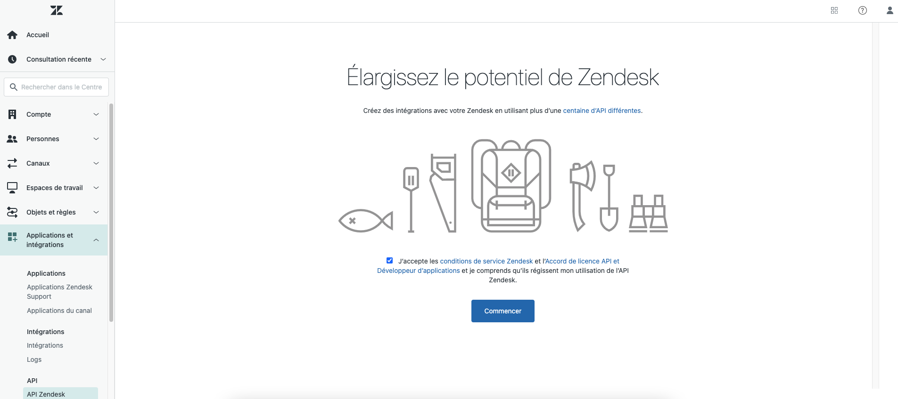
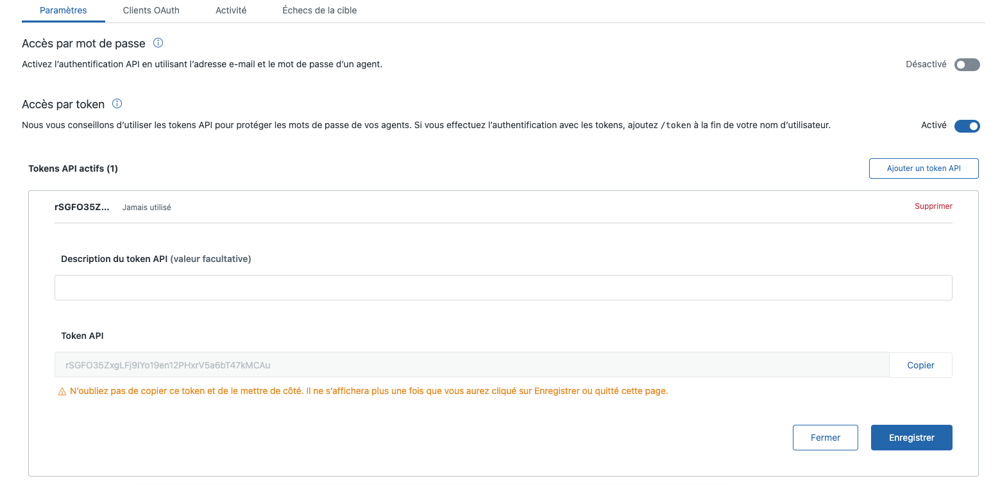
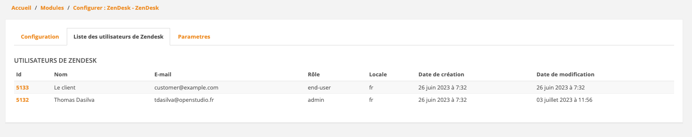

# Zend Desk

This module allows to retrieve the ticket of a retailer from ZenDesk

## Installation

### Manually

* Copy the module into ```<thelia_root>/local/modules/``` directory and be sure that the name of the module is ZenDesk.
* Activate it in your thelia administration panel

### Composer

Add it in your main thelia composer.json file

```
composer require thelia/zend-desk-module:~1.0
```

## Usage

First go to https://`{sous-domaine}`.zendesk.com/admin/apps-integrations/apis/zendesk-api/



Activate Token Access and add a token API
Copy your token and Save



Go to the configuration panel and add your subdomain, api token and Zendesk's username


When Connected, your customer will see their tickets from ZenDesk.

It's using the email of the retailer so be sure to add it in ZenDesk.


You should configure Zendesk Parameters

* user rules : allow your users to create and edit tickets or not (read-only  by default)
* tickets type : allow your users to see only requested or assigned ticket or all (assigned by default)

## Loop

[zendesk_users_loop]



You will see all the users who have both a Zendesk account and an account on your website
